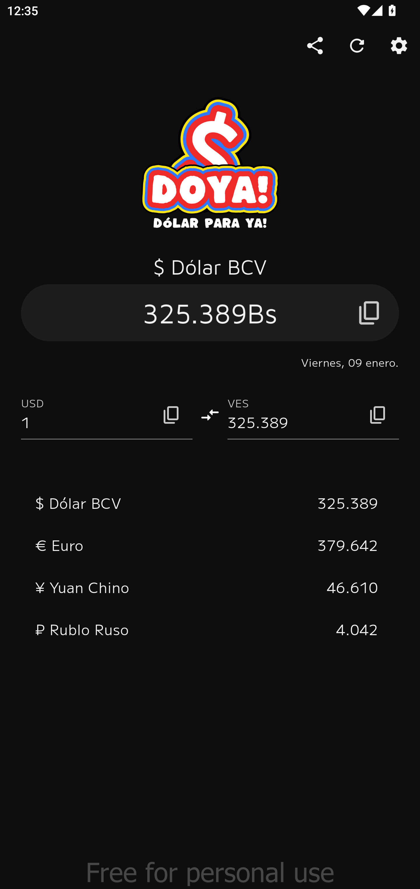
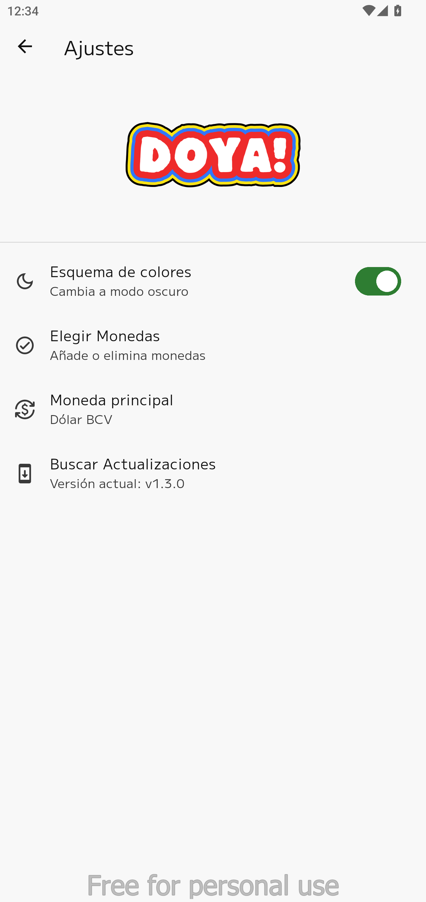
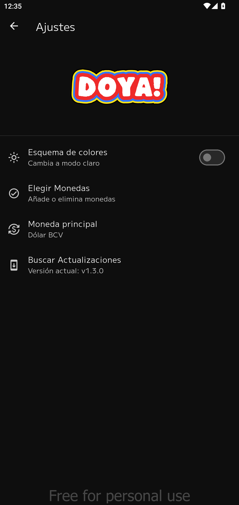

# DOYA! Dólar para ya

## ¿Qué es DOYA?

DOYA es una aplicación venezolana para Android que te permite tener siempre a la mano los precios de diferentes monedas en tu celular, no solamente sobre el dólar.

Con DOYA puedes calcular fácilmente el valor de cualquier moneda en bolivares.

|                        Modo oscuro                        |                  Modo claro                   |
| :-------------------------------------------------------: | :-------------------------------------------: |
|  |  |
|  |  |
